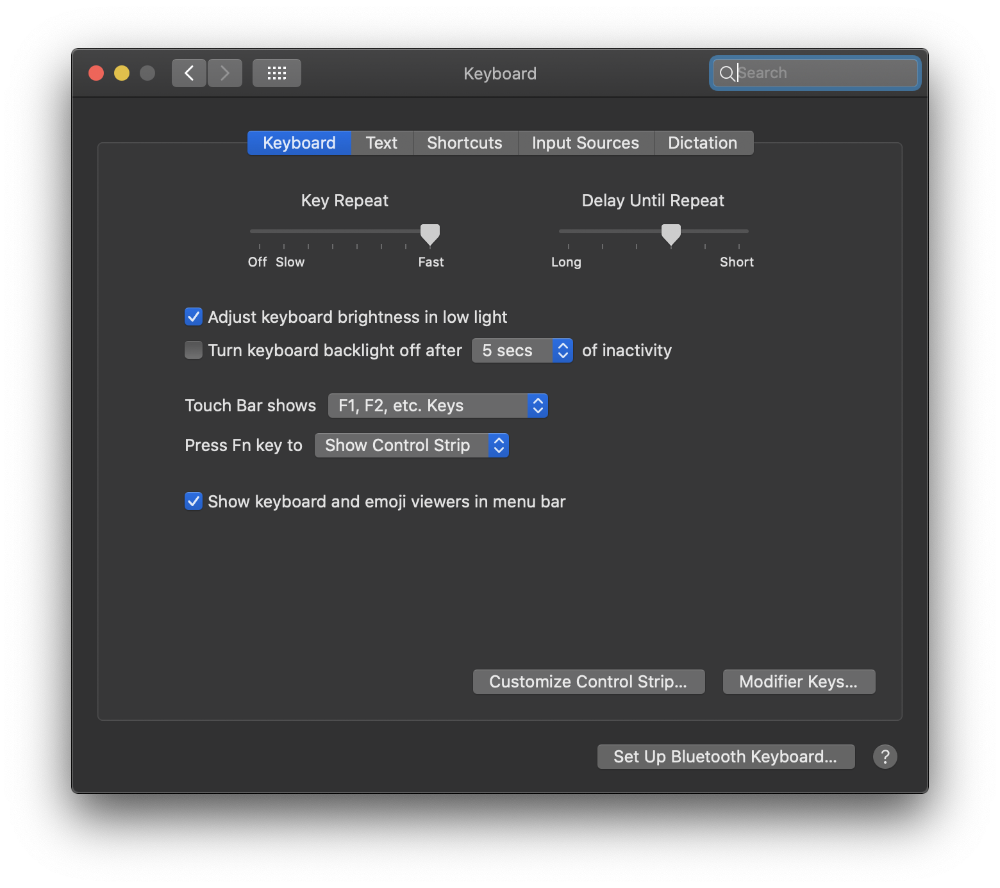
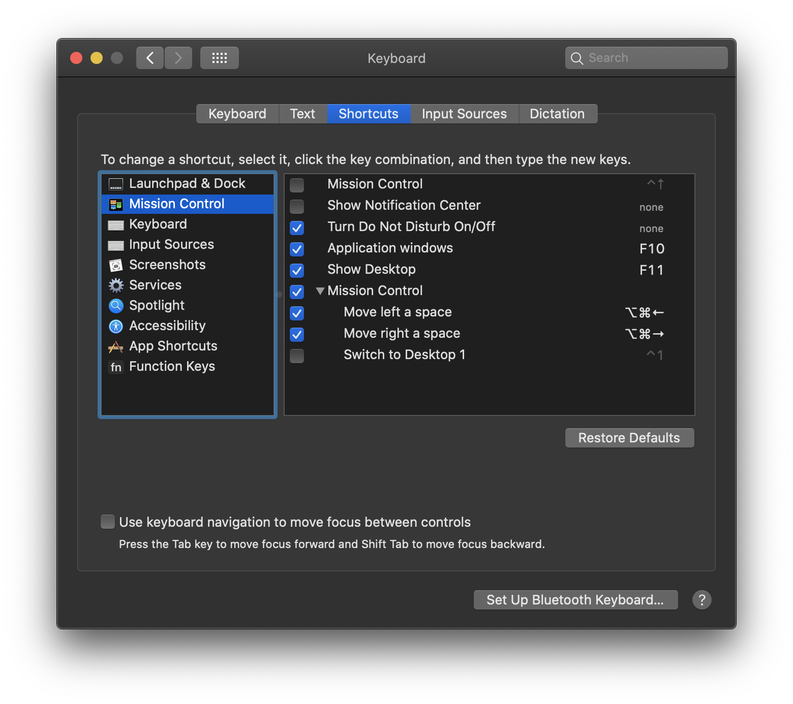
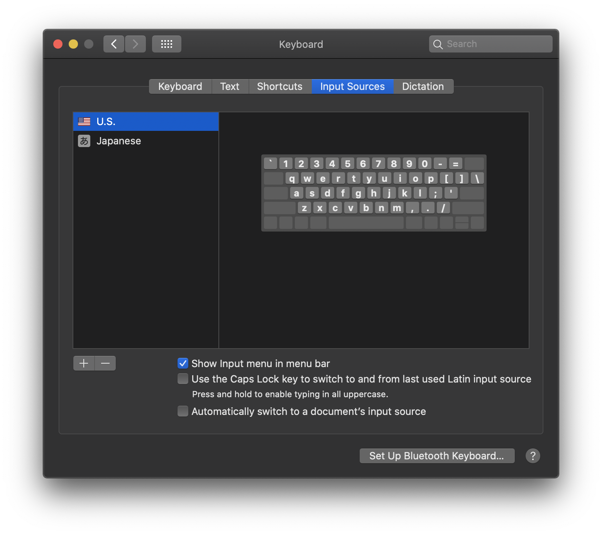
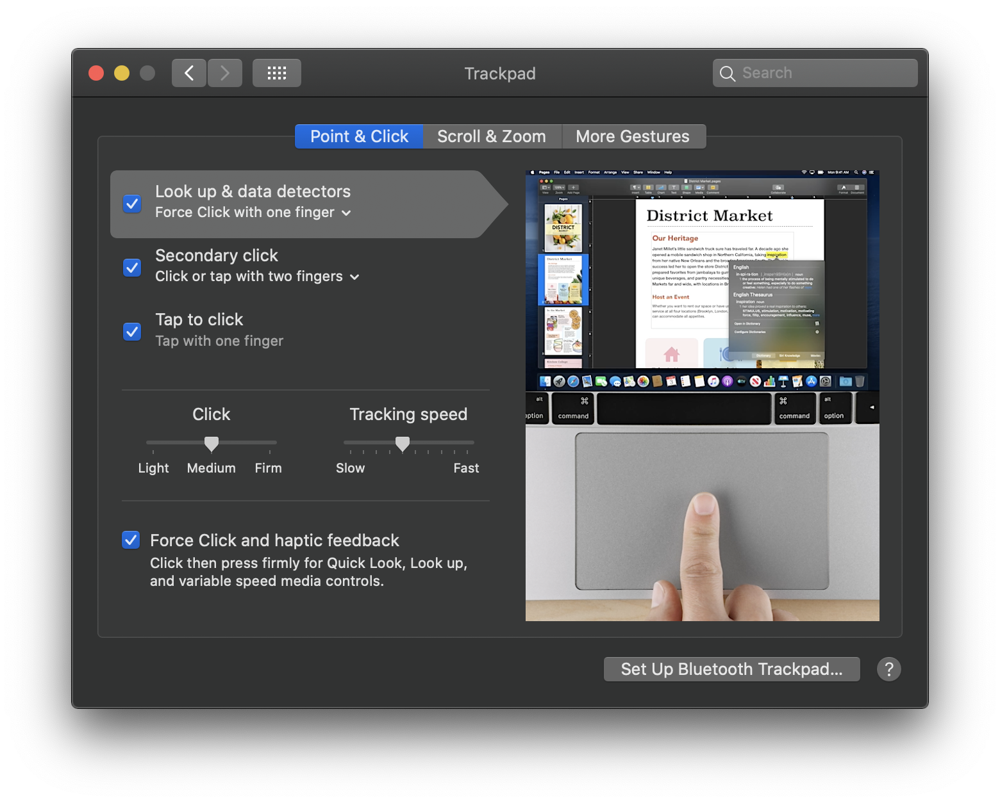
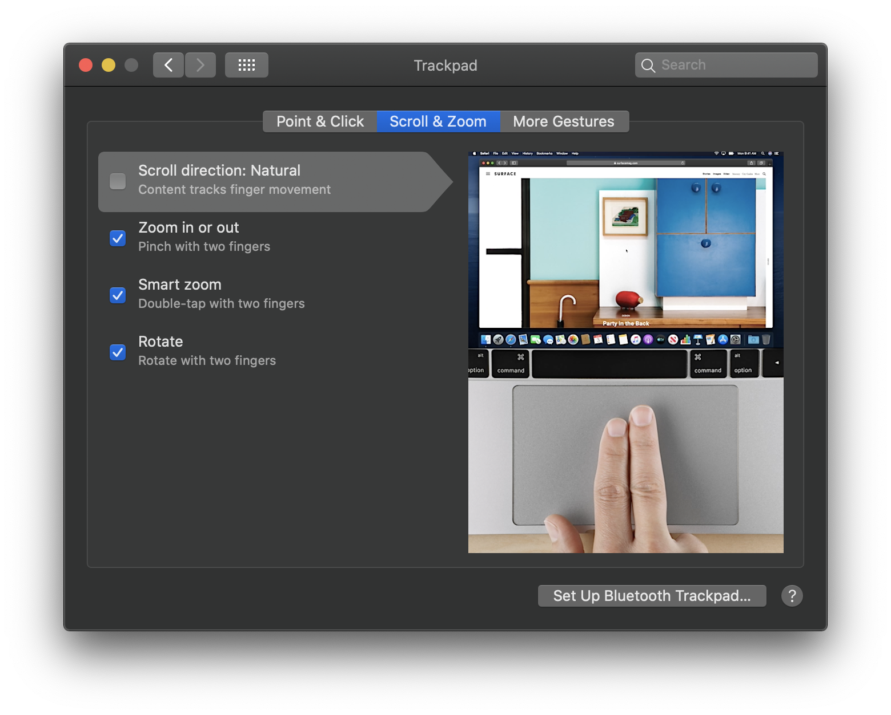
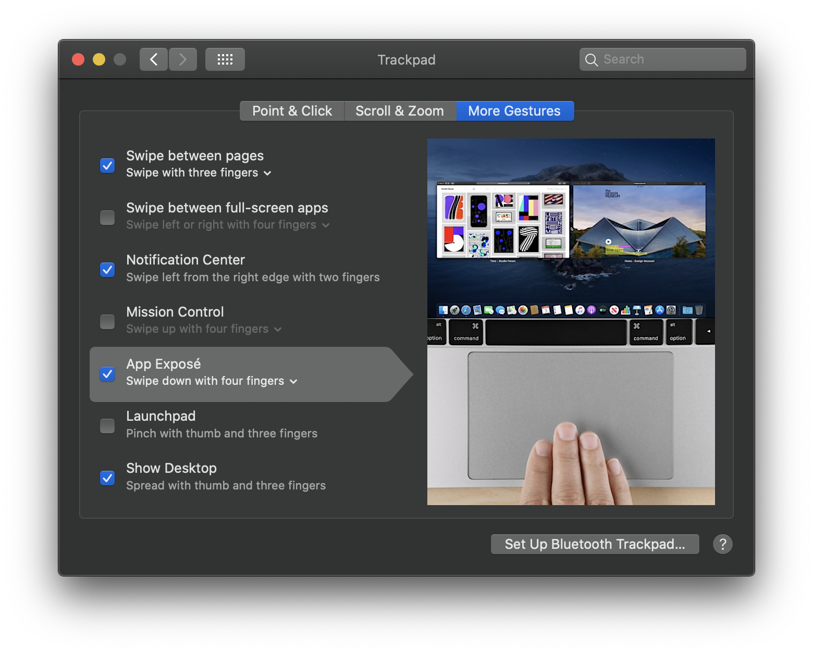

# Post-Reformat Guide for OSX

* Install any pending updates
* Download Google Chrome
* Set hostname:
```bash
scutil --set ComputerName "name"
scutil --set LocalHostName "name"
scutil --set HostName "name"
scutil --get HostName
```

## Homebrew
1. Install homebrew: `/bin/bash -c "$(curl -fsSL https://raw.githubusercontent.com/Homebrew/install/master/install.sh)"`
2. ```brew install awscli boost coreutils dockutil dos2unix fzf git gnu-sed htop hugo icdiff icu4c iftop jq libusb mtr p7zip proxychains-ng ripgrep socat source-highlight sqlite tree unrar watch wget xz```
3. `$(brew --prefix)/opt/fzf/install` # Install fzf

## Clear out the dock
```bash
for item in $(dockutil --list | cut -f 1);
  do
  dockutil --remove "$item" --allhomes
done
```

## Finder
* Show Hard Disks on the Desktop
* Customize finder toolbar to include Path button

## Install Nano w/ Syntax Highlighting
```bash
wget https://www.nano-editor.org/dist/v4/nano-4.9.3.tar.gz
tar -xvf nano-4.9.3.tar.gz
cd nano-4.9.3
./configure --prefix=/usr/local/
sudo make
sudo make install
echo "You're about to curl a file (https://raw.githubusercontent.com/scopatz/nanorc/master/install.sh) and pipe it to sh. You have 10 seconds to abort..."
sleep 10
curl https://raw.githubusercontent.com/scopatz/nanorc/master/install.sh | sh
```

## Transfer over data
* SSH Keys/config
* [Github personal access token](https://github.com/settings/tokens/)
* Keychains
* Re-install printer
* [dotfiles](dotfiles/)
* [ut](files/ut) (CLI time converter)
  * `sudo cp ut /usr/local/bin/ut`

## Security Software
* Little Snitch: https://obdev.at/products/littlesnitch/download.html
* Wireguard: https://apps.apple.com/us/app/wireguard/id1441195209
* BlockBlock: https://objective-see.com/products/blockblock.html
* What's Your Sign: https://objective-see.com/products/whatsyoursign.html
* ReiKey: https://objective-see.com/products/reikey.html
* Netiquette: https://objective-see.com/products/netiquette.html
* Task Explorer: https://objective-see.com/products/taskexplorer.html
* 1Password: https://1password.com/downloads/mac/
* 1Password Chrome Extension: https://chrome.google.com/webstore/detail/1password-extension-deskt/aomjjhallfgjeglblehebfpbcfeobpgk?hl=en

## Misc
* Disable paging in git: `git config --global pager.branch false`
* Don't rebase during git pull: `git config pull.rebase false --global`
* Create a global .gitignore file: `echo .DS_Store >> ~/.gitignore_global && git config --global core.excludesfile ~/.gitignore_global`
* Show hidden files: `defaults write com.apple.finder AppleShowAllFiles YES`
* [Allow TouchID to be used for sudo](https://dev.to/equiman/how-to-use-macos-s-touch-id-on-terminal-5fh)
* [Allow Apple Watch to be used for sudo](https://github.com/biscuitehh/pam-watchid)
* Remove old Mac from AppleID account
* Accessibility > Display > Reduce motion
* Dock: Minimize using scale effect

---

## Apps
#### Many can be installed from https://macapps.link/ if you trust it

### Multimedia
* Spotify
* VLC

### Utilities
* Flux
* nvALT
  * Restore data from `~/Library/Application Support/Notational Data`
* Carbon Copy Cloner
* aText
* Microsoft Remote Desktop
    * Restore data from `~/Library/Containers/com.microsoft.rdc.macos`
* [Acme.sh](https://github.com/acmesh-official/acme.sh)
* [Grand Perspective](https://apps.apple.com/us/app/grandperspective/id1111570163?mt=12)
* CyberChef

### Security
* Wireshark
* Nmap
* Shodan
    * `pip3 install --user shodan`
    * `shodan init <api_key>`

### Productivity
* Dropbox
* Spectacle
  * Restore data from `~/Library/Application Support/Spectacle/Shortcuts.json`
* [iStat Menus](configs/iStat.ismp) 
* Slack
* Skype 
* Zoom
* Chrome
    * Restore profile from `~/Library/Application Support/Google/Chrome`

### Developer
* [VSCode](https://marketplace.visualstudio.com/items?itemName=Shan.code-settings-sync)
* [iTerm2](configs/iTerm.json)
    * Install shell integration
* Golang

### DevOps
* VMware Fusion
* Vagrant
    * Restore data from `~/.vagrant.d`
    * Install VMware Utility
    * Install VMware License for Vagrant
* Packer 
* Terraform 
* Docker
* Ansible 
  * `pip3 install --user ansible pywinrm`

---

## Keyboard / Trackpad settings
1. Increase key repeat speed
2. Shorten delay
3. Change function keys
4. Update Mission Control hotkeys
5. Add an app shortcut for Lock Screen
6. Add Japanese as an input source








